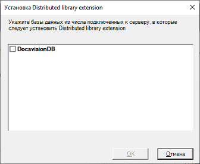

# Порядок обновления

1. Удалите версию Модуля для Docsvision 5.4.

   Также нужно удалить службу Модуля репликации справочников. Для этого выполните от имени администратора команду:

   ```
   sc delete "DvDistrService {Название профиля}"
   ```

   Здесь: `{Название профиля}` – название профиля Модуля репликации справочников, указанного при установке Модуля.

2. На компьютере с сервером Docsvision остановите все сервисы Docsvision (в IIS и службах Windows). Если используется кластер серверов Docsvision / СУБП, остановите сервисы на всех узлах.

3. Установите новую версию модуля из пакета установки `Docsvision 5 Directory Replication.msi` на все сервера Docsvision, участвующие в репликации.

   При завершении установки будет предложено выбрать обновляемые базы данных Docsvision. 

   

4. Выберите обновляемые базы данных и нажмите **OK**. Дождитесь завершения процесса.


