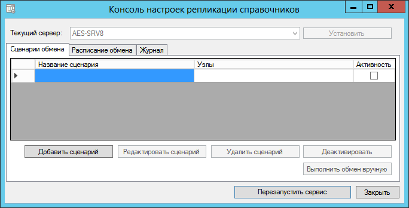
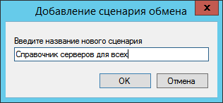
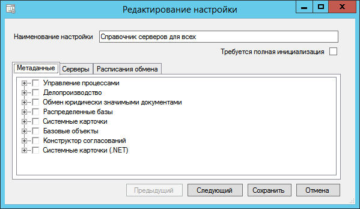
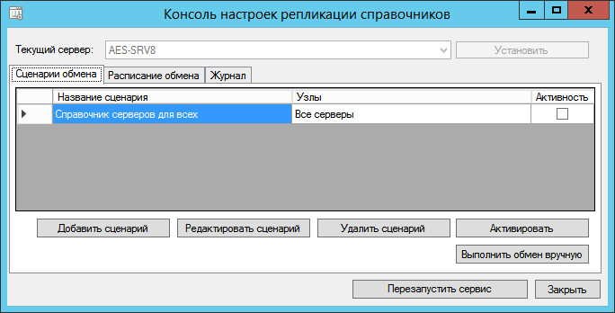
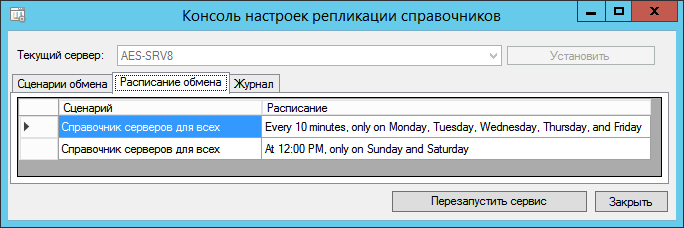

[[ariaid-title1]]
== Настройка сценария синхронизации

Сценарий синхронизации содержит информацию о том, какие карточки и секции должны синхронизироваться, какие сервера включены в процесс синхронизации, по какому сценарию производится фоновая синхронизация.

В зависимости от требований организации может быть настроено несколько сценариев синхронизации. Например, может быть настроена синхронизация одного набора данных с двумя удалёнными серверами Docsvision – для первого с периодичностью в 1 минуту, а для второго – раз в сутки.

Настройка сценариев синхронизации производится в «Консоли настроек репликации справочников Docsvision». Настройка возможна только после xref:SetCurrentServerDatabaseDocsvision.adoc[указания текущего сервера Docsvision].

Для настройки нового сценария:

. Запустите программу «Консоль настроек репликации справочников Docsvision» из меню Пуск от имени локального администратора.
. Выберите профиль подключения, для которого выполняется настройка, и нажмите кнопку [.ph .uicontrol]*Подключиться*. Будет открыто окно со списком сценариев синхронизации.
+
##Рис. 1. ##Сценарии синхронизации]
. Нажмите кнопку [.ph .uicontrol]*Добавить сценарий*. Будет предложено ввести название нового сценария синхронизации.
. Введите название и нажмите [.ph .uicontrol]*ОК*.
+
##Рис. 2. ##Добавление нового сценария]
+
Будет открыто окно редактирования сценария.

##Рис. 3. ##Параметры сценария обмена]
. Установите флаг [.ph .uicontrol]*Требуется полная инициализация*.
+
При установленном флаге при первой синхронизации на удалённые сервера будут переданы все карточки или все строки справочников, отмеченных для синхронизации. При последующих синхронизация будут передаваться только изменения, если не был изменён список синхронизируемых данных – в этом случае (единожды) будет передан полный набор данных.
+
Полная синхронизация типа карточки или секции выполняется также в том случая, если с момента предыдущей синхронизации прошло времени больше, чем срок, указанный в параметрах отслеживания изменений (по умолчанию 2 дня).
+
Флаг [.ph .uicontrol]*Требуется полная инициализация* рекомендуется устанавливать для главного сервера.
. Настройте сценарий:
[loweralpha]
.. xref:TuningCompositionSynchronizedData.adoc[Выберите синхронизируемые данные].
.. xref:ConfiguringSynchronizedServers.adoc[Выберите сервера Docsvision, на которые будут загружаться изменения].
.. xref:ScheduleSetupExchange.adoc[Настройте расписание фоновой синхронизации].
. Нажмите кнопку [.ph .uicontrol]*Сохранить*. Сценарий будет добавлен в список сценариев.
+
##Рис. 4. ##Сценарии синхронизации]
+
Расписания всех сценариев отображаются на странице «Расписание обмена».
+
##Рис. 5. ##Расписание сценариев синхронизации]
. Выберите добавленный сценарий в списке и нажмите кнопку [.ph .uicontrol]*Активировать*. Справа от строки сценария будет установлен флаг «Активность».
. Аналогичным образом настройте другие сценарии синхронизации.
. Нажмите кнопку [.ph .uicontrol]*Выполнить обмен вручную* для запуска процесса синхронизации.
+
Первую синхронизацию рекомендуется выполнять вручную.
. После завершения настройки сценариев нажмите кнопку [.ph .uicontrol]*Перезапустить сервис*. Сервис репликации справочников будет перезапущен.
+
Сервис репликации нужно перезапускать после каждого изменения сценариев синхронизации.

* *xref:../topics/TuningCompositionSynchronizedData.adoc[Настройка состава синхронизируемых данных]* +
* *xref:../topics/ConfiguringSynchronizedServers.adoc[Настройка синхронизируемых серверов]* +
* *xref:../topics/ScheduleSetupExchange.adoc[Настройка расписания фоновой синхронизации]* +

*На уровень выше:* xref:../topics/Administrator_functions.adoc[Функции администратора]
