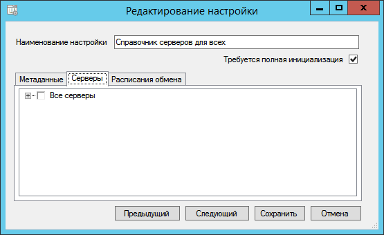

[[ariaid-title1]]
== Настройка синхронизируемых серверов

. Перейдите на страницу «Серверы» окна xref:ConfiguringScriptSynchronization.adoc[настройки сценария обмена].
+
##Рис. 1. ##Настройка состава синхронизируемых данных]
+
В дереве перечисляются сервера, зарегистрированные в Справочнике серверов текущего сервера (и БД) Docsvision. Текущий сервер в списке не отображается.
. Отметьте определённые сервера, на которые должны передаваться изменения данных, или «Все серверы».

*На уровень выше:* xref:../topics/ConfiguringScriptSynchronization.adoc[Настройка сценария синхронизации]
