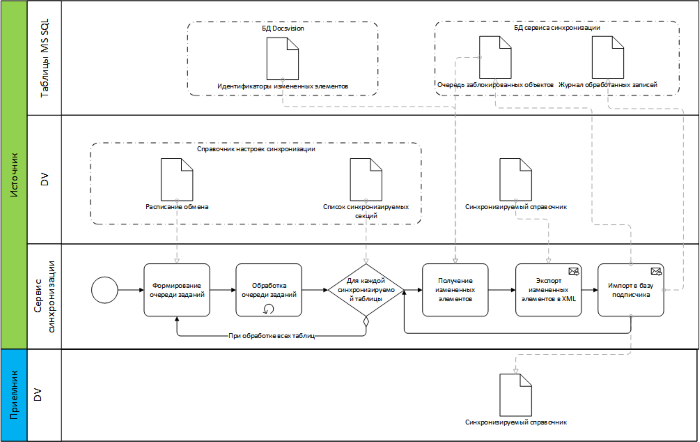

[[ariaid-title1]]
== Описание процесса синхронизации

##Рис. 1. ##Описание процесса синхронизации]

Процесс синхронизации данных состоит из следующих шагов:

. При старте сервиса репликации на сервере-публикаторе производится чтение карточки «Справочник распределенных баз» и анализ расписания обмена каждого из сценариев. На основе анализа формируется задание на синхронизацию по каждому сценарию для каждого сервера-подписчика. Сформированные задания помещаются в очередь с вычисленным на основе расписания временем выполнения.
. В заданное время производится выполнение процедуры синхронизации по указанному сценарию для указанного сервера-подписчика. При этом:
[loweralpha]
.. Из справочника распределенных баз анализируется состав метаданных, включенных в сценарий синхронизации, определяется набор таблиц, которые должны быть синхронизированы (см. xref:TuningCompositionSynchronizedData.adoc[Настройка состава синхронизируемых данных]).
.. Для каждой таблицы производится считывание идентификаторов тех записей, которые были изменены с момента предыдущей синхронизации. Если последняя синхронизированная версия таблицы меньше минимально доступной версии таблицы в БД или синхронизация производится первый раз и у сервера-публикатора установлен режим «Требуется полная инициализация», то измененными считаются все записи таблицы.
.. Для каждой измененной записи производится экспорт в XML стандартными средствами Docsvision.
.. Производится вызов методом серверного расширения на сервере-подписчике с передачей данных в формате XML.
.. Информация о синхронизации объекта фиксируется в журнале синхронизации (см. xref:JournalSynchronizedData.adoc[Журнал синхронизированных данных]).
.. В случае разрыва соединения с сервером-подписчиком сервис производит переподключение к удаленному серверу. Количество попыток переподключения и интервал между попытками указывается в настройках сервера-публикатора.
.. По завершении синхронизации для указанного сервера подписчика фиксируется текущий номер версии таблиц, начиная с которой будет произведена синхронизация в следующей итерации обмена.
.. Если синхронизация прошла неуспешно (отсутствует соединение с удаленным сервером), версия последней синхронизации для данного сервера-подписчика не меняется, информация об ошибке фиксируется в журнале приложений Windows (см. xref:LogSynchronizationService.adoc[Журнал Сервиса репликации справочников]).
. По завершении этапа синхронизации производится расчет нового времени выполнения на основе расписания обмена и постановка задания синхронизации в очередь.

*На уровень выше:* xref:../topics/Structure.adoc[Архитектура модуля]
