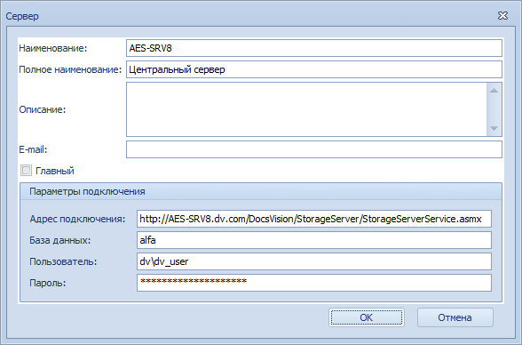

[[ariaid-title1]]
== Заполнение справочника серверов

В Справочник серверов нужно добавить все сервера Docsvision, участвующие в процессе репликации (публикаторы и подписчики).

Заполнять справочник следует на одном основном сервере (с будущей ролью – публикатор), а затем скопировать на другие сервера Docsvision, используя механизм репликации данного модуля – включить справочник в сценарий синхронизации с остальными серверами. Важно, чтобы внутренние идентификаторы элементов справочника совпадали на разных серверах.

. Откройте [.dfn .term]_Справочник серверов_ в Windows-клиенте.
. Нажмите кнопку . Будет открыто окно добавления сервера.
. Укажите информацию о сервере Docsvision:
* Наименование – краткое название сервера.
* Полное название.
* Описание – дополнительная информация о сервере – если требуется.
* Адрес подключения – адрес подключения к данному серверу Docsvision в формате [.ph .filepath]`http://<Имя сервера Docsvision>/DocsVision/StorageServer/StorageServerService.asmx`.
* База данных – название базы Docsvision, с которой производится синхронизация – указывается, если синхронизация должен выполняться не с БД по умолчанию.
* Пользователь/ Пароль – данные учетной записи, от имени которой будет выполняться подключение к данному серверу. Учетная запись должна обладать правами администратора Docsvision.
+
##Рис. 1. ##Пример заполнения Справочника серверов]
. Включите справочник в сценарий репликации после завершения настройки Модуля репликации справочников.

*На уровень выше:* xref:../topics/HowConfig.adoc[Подготовка к работе]
