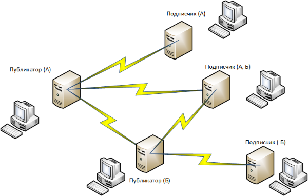

[[ariaid-title1]]
== Общее описание архитектуры

Основу архитектуры решения представляет организация территориально-распределенных серверов Docsvision по принципу «Публикатор» – «Подписчик».

Публикатор – сервер Docsvision, на котором производится накопление изменений и их отправка серверам-подписчикам.

##Рис. 1. ##Общее описание архитектуры]

Каждый сервер Docsvision может выступать как публикатором, так и подписчиком, что позволяет обеспечить двустороннюю синхронизацию измененных данных.

Принципы работы:

. Для накопления изменений на сервере-публикаторе производится включение режима отслеживания изменений таблиц на уровне БД.
. Сбор накопленных изменений производится специальным приложением (службой в случае фоновой синхронизации или пользовательской программой в случае принудительной синхронизации). Это же приложение и производит отправку измененных данных на сервера-подписчики.
. Отправка изменений серверам-подписчикам производится путем прямого подключения к удаленному серверу-подписчику и вызова методов специального серверного расширения.

Для исключения повторной отправки изменений на сервер, на котором эти изменения порождены, к данным добавляется идентификатор сервера Docsvision, на котором были созданы или изменены записи: при создании строки секции идентификатор текущего сервера сохраняется в системное поле «OwnerServerID», при изменении строки секции – в системное поле «ChangeServerID».

В момент синхронизации серверу-подписчику отправляются все измененные данные, кроме тех, которые были изменены на сервере-подписчике.

*На уровень выше:* xref:../topics/Structure.adoc[Архитектура модуля]
