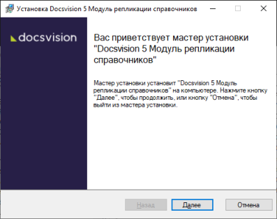
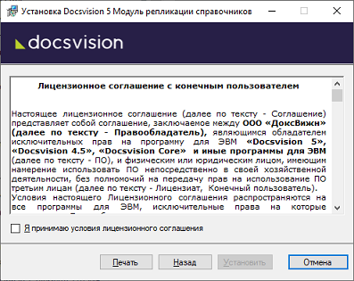
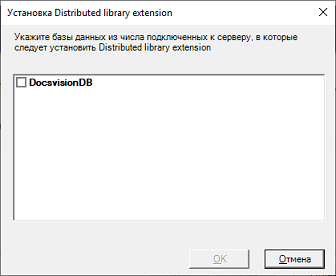

[[ariaid-title1]]
== Установка Модуля

Модуль репликации справочников должен быть установлен [.keyword]*на все сервера Docsvision*, участвующие в репликации.

Пользователь, выполняющий установку, должен обладать правами локального администратора и быть членом группы «Docsvision Administrators» на компьютере с сервером Docsvision, на который устанавливается модуль.

. [.ph .cmd]#Запустите пакет установки [.ph .filepath]`Docsvision 5 Directory Replication.msi`.#
+
##Figure 1. ##Мастер установки Модуля репликации справочников]
. [.ph .cmd]#Примите условия лицензионного соглашения для продолжения установки.#
+
##Figure 2. ##Условия лицензионного соглашения]
. [.ph .cmd]#Нажмите на кнопку [.ph .uicontrol]*Установить* и дождитесь завершения установки Модуля.#
. [.ph .cmd]#После завершения установки модуля будет предложено выбрать БД Docsvision для установки расширения «Модуль репликации справочников». Выберите базы данных, при работе с которыми будет использоваться Модуль.#
+
##Figure 3. ##Окно выбора баз данных для установки расширения]

После установки расширении будет предложено перезапустить сервисы Docsvision. Согласитесь с перезапуском.

*Parent topic:* xref:../topics/Install_and_configuration.adoc[Установка и настройка]
