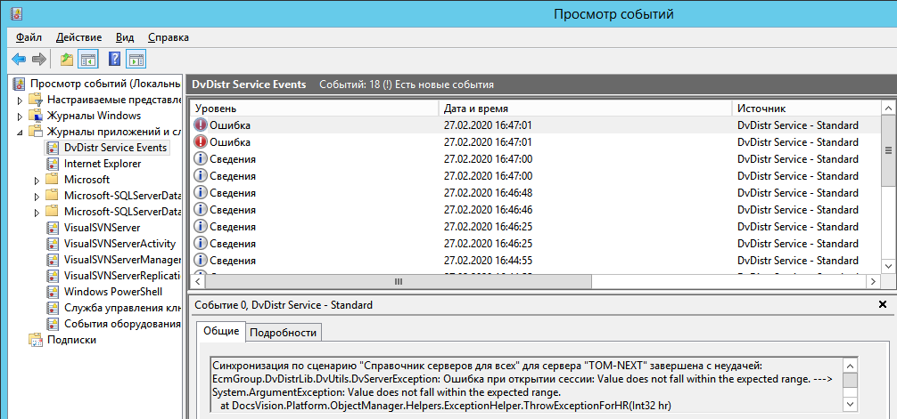

[[ariaid-title1]]
== Журнал Сервиса репликации справочников

Дополнительным источником информации о работе сервиса репликации может служить журнал приложений «DvDistr Service Events». Данный журнал можно просмотреть в диспетчере сервера.

##Рис. 1. ##Журнал Сервиса репликации справочников]

В данном журнале фиксируются все запуски синхронизации по расписанию и статус их выполнения.

*На уровень выше:* xref:../topics/DiagnosticsSynchronizationProcess.adoc[Диагностика процесса синхронизации]
