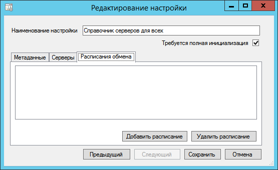
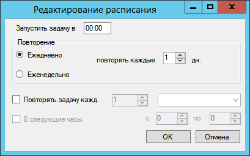

[[ariaid-title1]]
== Настройка расписания фоновой синхронизации

. Перейдите на страницу «Расписание обмена» окна xref:ConfiguringScriptSynchronization.adoc[настройки сценария обмена].
+
##Рис. 1. ##Настройка состава синхронизируемых данных]
. Нажмите кнопку [.ph .uicontrol]*Добавить расписание*. Будет открыто окно настройки расписания.
+
##Рис. 2. ##Настройка расписания]
. Настройте периодичность синхронизации и нажмите кнопку [.ph .uicontrol]*ОК*.
+
Можно установить определённое время запуска фоновой синхронизации, ежедневное или еженедельное повторение с указанием дней недели, в которое должна производиться синхронизация, интервалы повторения синхронизации в часах, минутах, секундах, а также указать ограничение на часы, в которые срабатывает расписание.
+
Для изменения расписания дважды щелкните по строчке изменяемого расписания.
. Если требуется, аналогичным образом добавьте другие расписания синхронизации.

[NOTE]
====
[.note__title]#Прим.:# Фоновая синхронизация будет запущена, если:

. Завершён предыдущий процесс синхронизации.
. Служба синхронизации запущена и работает.
====

*На уровень выше:* xref:../topics/ConfiguringScriptSynchronization.adoc[Настройка сценария синхронизации]
