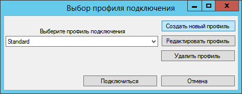
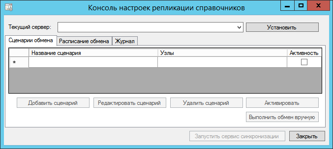

[[ariaid-title1]]
== Установка текущего сервера в БД Docsvision

В конфигурацию БД Docsvision должен быть добавлен идентификатор сервера Docsvision, которому принадлежит данная БД. Процедура выполняется единожды для каждого профиля подключения – фактически для каждой рабочей БД текущего сервера Docsvision. После выполнения процедуры изменить идентификатор будет невозможно.

. Запустите программу «Консоль настроек репликации справочников Docsvision» из меню Пуск от имени локального администратора. Будет открыто окно выбора и настройки профилей подключения.
+
##Рис. 1. ##Выбор профиля подключения]
. Выберите профиль подключения с БД Docsvision, в конфигурацию которой будет добавлен идентификатор текущего сервера Docsvision.
. Нажмите кнопку [.ph .uicontrol]*Подключиться*. Будет открыто окно настройки сценариев обмена.
+
##Рис. 2. ##Настройка сценариев обмена]
. В списке [.ph .uicontrol]*Текущий сервер* выберите текущий сервер Docsvision.
+
В списке отображаются сервера, зарегистрированные в Справочнике серверов в сервера Docsvision, указанного в профиле подключения.
+
*После выполнения процедуры изменить идентификатор будет невозможно*.
. Нажмите кнопку [.ph .uicontrol]*Установить*. Будет выдано предупреждение о необходимости перезапуска Docsvision.
+
Программа будет закрыта.
. Перезапустите сервисы Docsvision.

*На уровень выше:* xref:../topics/HowConfig.adoc[Подготовка к работе]
