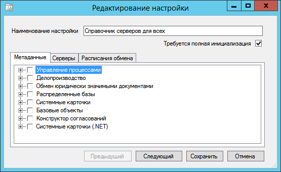

[[ariaid-title1]]
== Настройка состава синхронизируемых данных

. Перейдите на страницу «Метаданные» окна xref:ConfiguringScriptSynchronization.adoc[настройки сценария обмена].
+
##Рис. 1. ##Настройка состава синхронизируемых данных]
+
В дереве на первом уровне перечисляется список библиотек, которые загружены в текущую базу Docsvision. На втором уровне дерева перечисляется список карточек данной библиотеки.
. Выберите данные, которые нужно синхронизировать.
+
Если карточка не является справочником, то узел, соответствующий карточке, не имеет вложенных элементов. Для таких карточек, отмеченных флажком, на текущем сервере включается режим отслеживания изменений. В случае любого изменения карточки такого типа в момент синхронизации на удаленный сервер выгружается вся карточка со всеми вложенными секциями.

[NOTE]
====
[.note__title]#Внимание:# Для переноса карточек между удалёнными серверами Docsvision рекомендуется использовать модуль «Docsvision 5. Модуль межфилиального обмена».
====
+
Если карточка помечена как справочник, то соответствующий узел содержит вложенные элементы. Каждый вложенный элемент соответствует секции указанного справочника. Необходимо отметить флажком те секции, для которых включается режим отслеживания изменений. В случае изменения строки отмеченной флажком секции в момент синхронизации на удаленный сервер выгружается измененная строка. При синхронизации конкретной строки производится также синхронизация строк родительских секций.
+
Например, для синхронизации справочника серверов, необходимо флажком отметить секцию «Серверы» справочника серверов, а также карточку «Карточка сервера» из библиотеки «Базовые объекты».
+
[NOTE]
====
[.note__title]#Внимание:# Метаданные синхронизируемых карточек должны совпадать на всех серверах Docsvision.

Расширенные поля хранятся не в карточках, поэтому не синхронизируются вместе с карточкой. Также не синхронизируются хранящиеся в файлах данные карточек, в частности, таких, как Конструктор разметок; Карточка сохраненных представлений; Карточка сохраненных поисковых запросов и т. п. – для распространения подобных справочников/карточек рекомендуется воспользоваться модулем «Docsvision 5. Менеджер решений».
====

*На уровень выше:* xref:../topics/ConfiguringScriptSynchronization.adoc[Настройка сценария синхронизации]
